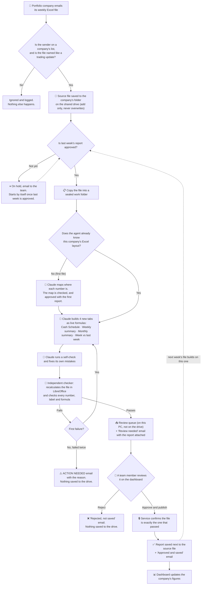
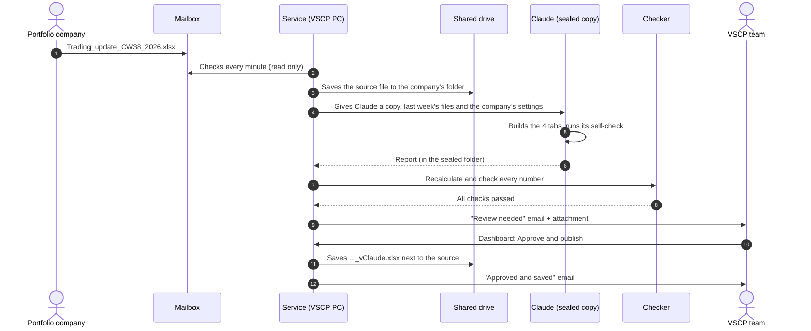
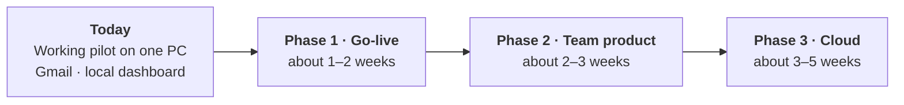

# How the VSCP Trading-Update Agent works

A plain-English guide for the VSCP team: what the agent does, what is finished at this stage, what it can't do yet, and what VSCP needs to provide to turn it into a finished product.

For installation, see the main [`README.md`](../README.md). For the next stage (running it safely on an always-on PC or in the cloud, connected to VSCP's Microsoft 365 email and shared drive), see [`NEXT_STEPS.md`](NEXT_STEPS.md).

---

## 1. In one paragraph

Every week, each portfolio company emails VSCP an Excel "trading update". Today an analyst opens it, adds a cash schedule, cash summaries and a comparison with last week, checks the numbers and saves the result on the shared drive. The agent does this work automatically. It watches a mailbox, recognises which company sent the file, and has **Claude** (Anthropic's AI) build the four new tabs as **live Excel formulas**. A separate, non-AI checker then recalculates the file and **checks every number** independently. The result waits for a **person to approve it**. Only an approved report is saved to the shared drive, next to the company's file.

## 2. Who does what

| Part | What it is | What it does | What it can never do |
|---|---|---|---|
| **The service** | A program running on one Windows PC | Checks the mailbox every minute, runs each week's job, sends the emails, saves approved files | Save anything a person hasn't approved |
| **Claude** | The AI that builds the report | Reads the week's Excel file and writes the new tabs as formulas | Reach the shared drive, the mailbox or the internet. It works on a **copy** in a sealed folder |
| **The checker** | Ordinary program code, no AI | Recalculates the report and compares every number with its own independent calculation | Be persuaded or skipped: a report that fails isn't shown for approval |
| **The dashboard** | A web page on the same PC | Shows every company's figures, and the **Review queue** where a person approves or rejects | Write to the drive or send email |
| **The team** | VSCP staff | Receive the emails, review the report, click **Approve and publish** or **Reject** | |

## 3. The whole workflow

### What happens in one week, step by step

Typical timings: the file is picked up within a minute, and the "Review needed" email arrives about **5 minutes** later.

## 4. How it stays safe

```mermaid
flowchart LR
    subgraph L1["1 · Who can send"]
        a1["Only allow-listed sender addresses"]
        a2["Only Excel files with the expected name"]
        a3["Macros are never run"]
    end
    subgraph L2["2 · What Claude can touch"]
        b1["Works on a copy in a sealed folder"]
        b2["No internet, no drive, no email"]
        b3["Text inside the file is treated as data, never as instructions"]
        b4["Spend and steps capped per run"]
    end
    subgraph L3["3 · Is it right?"]
        c1["Independent recalculation of every number"]
        c2["Exact layout check against VSCP's sample report"]
        c3["Formulas must be live, not typed-in numbers"]
    end
    subgraph L4["4 · A person decides"]
        d1["Nothing reaches the drive without approval"]
        d2["The approved file must be byte-for-byte the checked one"]
        d3["The drive is only added to: nothing is overwritten or deleted"]
    end
    L1 --> L2 --> L3 --> L4
```

## 5. What is finished at this stage

**The weekly workflow, end to end**
- Reading a Gmail mailbox, recognising the company by its sender address, and saving the source file to the right folder on the drive.
- Claude building the four tabs in exactly the layout of VSCP's sample report, as live formulas, in VSCP's formatting.
- The independent checker: about 160 checks per report. In testing, every report that could be built passed on the first attempt.
- One automatic retry when a report fails, then an **ACTION NEEDED** email with the reason.
- The review queue, approval or rejection on the dashboard, and the emails: Review needed, Approved and saved, Rejected, On hold, ACTION NEEDED.
- Weeks that arrive in the wrong order are held and released automatically in the right order.
- A resent, corrected file is kept as a revision (`_r2`) and processed again; nothing is overwritten.

**More than one company**
- Any number of portfolio companies, each with one settings file (`companies\`). The template is in `company_template\`.
- A company whose Excel file is laid out differently is handled: Claude maps its layout on the first file, the map is checked, and a person approves it with the first report.

**The dashboard**
- **Portfolio** page: all companies, headline figures, what needs attention.
- **Companies** page: each company's revenue, gross profit, customers and cash over time.
- **Review queue**: each report's checks, its figures against last week, warnings, and where every typed-in value came from.
- A status bar showing whether the service is running and what it is working on.

**Running it**
- One-command setup and start, a configuration check that names anything missing, optional automatic start at Windows logon, logs, and an alert when the mailbox can't be read.
- A Microsoft 365 mailbox connection is written, and tested against a simulated Microsoft service only.

**Tested:** real Claude runs on Inceptua's weeks and on test companies with different layouts, passing every check, at about **$0.40–1.00 per report** (about $1.50 the first time a new layout is learned).

## 6. Limitations today

| Limitation | What it means in practice | How it's solved (section 8) |
|---|---|---|
| **Runs on one PC** | If that PC is off, asleep or restarted, nothing is processed until it's back | Always-on PC or cloud VM |
| **Nobody is told if the PC stops** | The dashboard shows "Service not running", but only to someone who opens it | External "dead-man's switch" alert |
| **Gmail, not VSCP's Microsoft 365** | Companies send to a Gmail address; the emails come from Gmail | Microsoft 365 connection, needs IT setup |
| **Dashboard only on that PC** | Reviewers must sit at it or use Remote Desktop | Microsoft sign-in in front of the dashboard |
| **Approval records a typed name** | Anyone at the PC can approve under any name | Record the signed-in Microsoft account instead |
| **Every reviewer sees every company** | No per-person access | Per-user company lists |
| **One report at a time** | 20 companies arriving at once take about 2 hours | Process 2–3 in parallel on a dedicated machine |
| **Only the trading-update template** | A completely different kind of report (e.g. a monthly board pack) needs new instructions and checks | New "skill" per report type |
| **No deadline alerts** | No "Company X hasn't sent its file by Monday" email (a deliberate choice for now) | Add if VSCP wants it |
| **The opening bank cash question** | The Cash Schedule uses the company's total bank cash; the sample used one account | VSCP answers the question below |
| **Data goes to Anthropic** | Each week's workbook is sent to Anthropic's API | VSCP confirms this fits its data policy |

**The opening bank cash question, in detail.** In VSCP's sample report, the Cash Schedule's opening bank cash is `Cash!I28`: **one bank account** (Inceptua NL, Citi Bank, about EUR 109k). The agent uses `Cash!I29`, **total cash at operating companies** (about EUR 18.5M), which matches the balance sheet. With I28, every projected bank-cash balance is about EUR 18.4M lower. To confirm:
- Was I28 a slip, or does the schedule deliberately track one entity's account?
- Should bank cash open at the model start date (1 June 2026) rather than at the weekly snapshot? Opening at the snapshot and then adding the flows since 1 June may count those months twice.
- Should restricted cash, or Holdco / "Pharma Model" cash, be included?

If I28 was intended, it's a one-line change in the agent.

## 7. What VSCP needs to provide

**Answers and decisions**
1. **The opening bank cash question** (section 6): total bank cash or one account, and whether it should open at the model start date.
2. **Data policy approval** for sending the weekly workbooks to Anthropic's API under VSCP's own Anthropic account.
3. **Who reviews and approves** reports, and whether some reviewers should see only some companies.
4. **One house style or each company's own look** for the generated tabs.
5. Whether VSCP wants **missing-file / deadline alerts**.

**Information, per portfolio company**
6. The **folder name** on the shared drive and the folder structure for weekly files.
7. The **email addresses** each company sends from.
8. Its **financing terms**: model start date and PO advance rate.
9. The **opening loan balance** for its first week, if no earlier report is on the drive.
10. One recent **example file** from each company, to confirm the layout is mapped correctly before go-live.

**Access and infrastructure (IT)**
11. A **dedicated Microsoft 365 mailbox** and app access for the agent ([`NEXT_STEPS.md`](NEXT_STEPS.md), section 3; about an hour for IT).
12. An **always-on Windows machine or cloud VM** with 8 GB+ memory, with the shared drive synced on it.
13. A **service account** with add-only permission on the report folders.
14. **Microsoft sign-in in front of the dashboard** (Entra application proxy, about half a day for IT), so reviewers can use it from their own PCs.
15. An **Anthropic account** owned by VSCP, with a monthly spending limit.

## 8. What would be built to reach product level

**Phase 1: Go-live at VSCP (about 1–2 weeks, once items 1–13 above are in place)**
- Connect VSCP's Microsoft 365 mailbox and test it on the real tenant.
- Move to the always-on machine with the service account and add-only drive permissions.
- Set up every portfolio company, and approve each new layout map on a real file.
- Apply VSCP's answer on opening bank cash.
- **Dead-man's switch:** if the service stops, the team is alerted within 30 minutes.
- A dry run on last month's files for every company, checked against the analysts' own reports.

**Phase 2: A product for the whole team (about 2–3 weeks)**
- **Microsoft sign-in** on the dashboard; approvals record the signed-in person.
- **Per-user access** to companies.
- **Faster runs:** 2–3 companies in parallel, and no repeated recalculation. 20 companies in under an hour.
- Optional **deadline alerts** for missing files, and optional Teams notifications.
- Optional: ask questions about the portfolio data from Claude Desktop (read-only).

**Phase 3: Cloud (about 3–5 weeks)**
- Run in VSCP's Azure instead of on a PC: no machine to keep on, backups and health alerts included.
- Read and write SharePoint directly instead of through a synced folder.
- Start a run the moment an email arrives instead of checking every minute.
- The dashboard becomes a proper web app with Microsoft sign-in and an audit trail.

**What carries over unchanged** through every phase: Claude's instructions, the checker, the safety rules and the approval step. Only where it runs and how it connects change.
